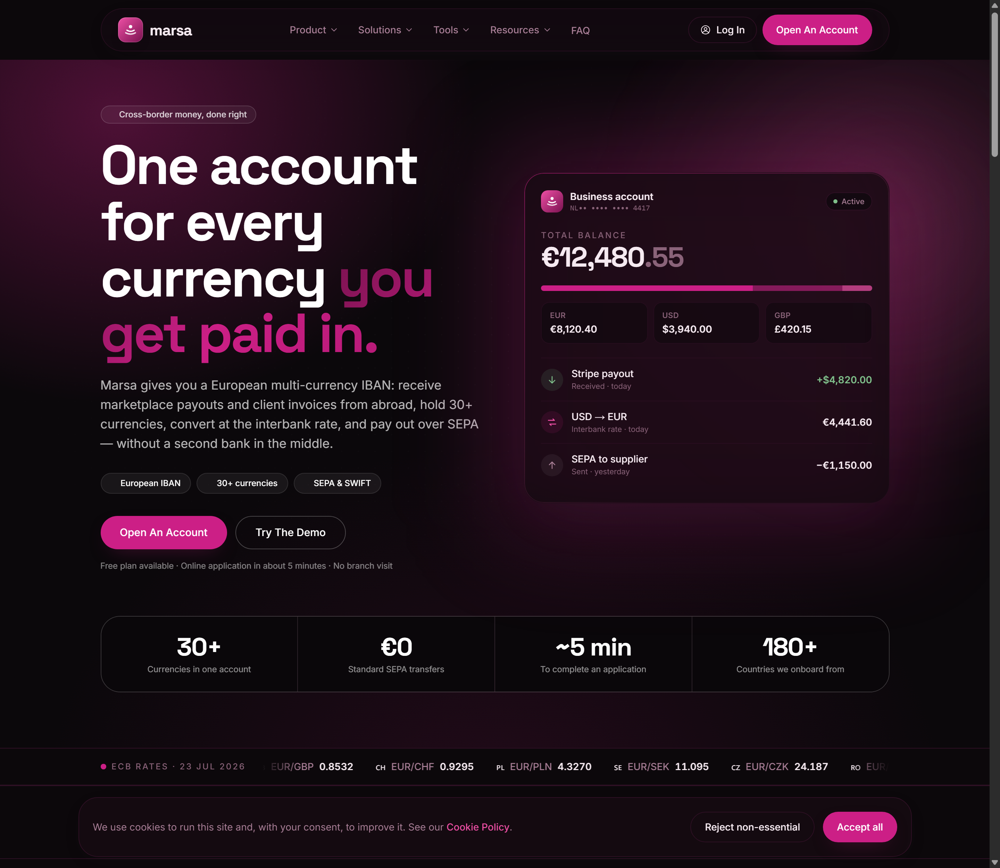
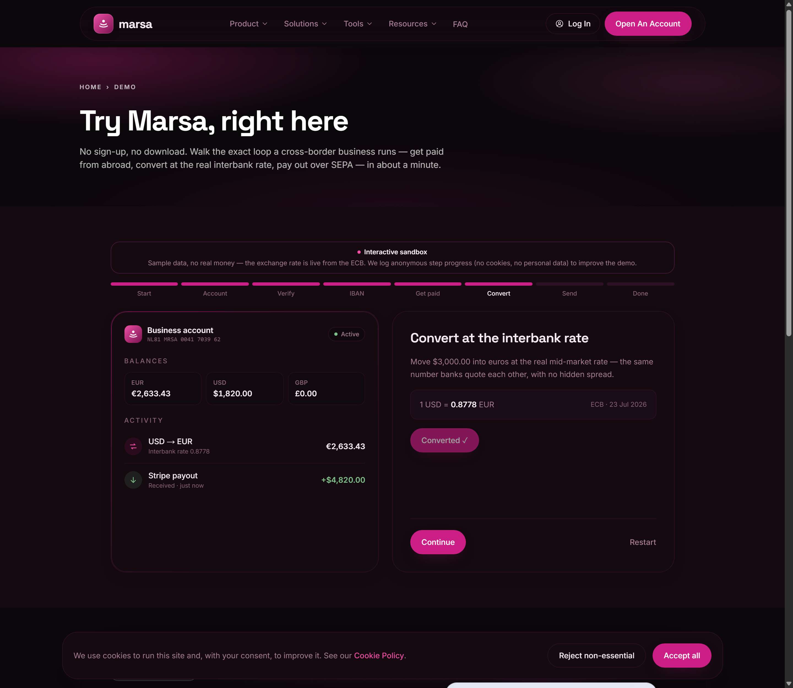
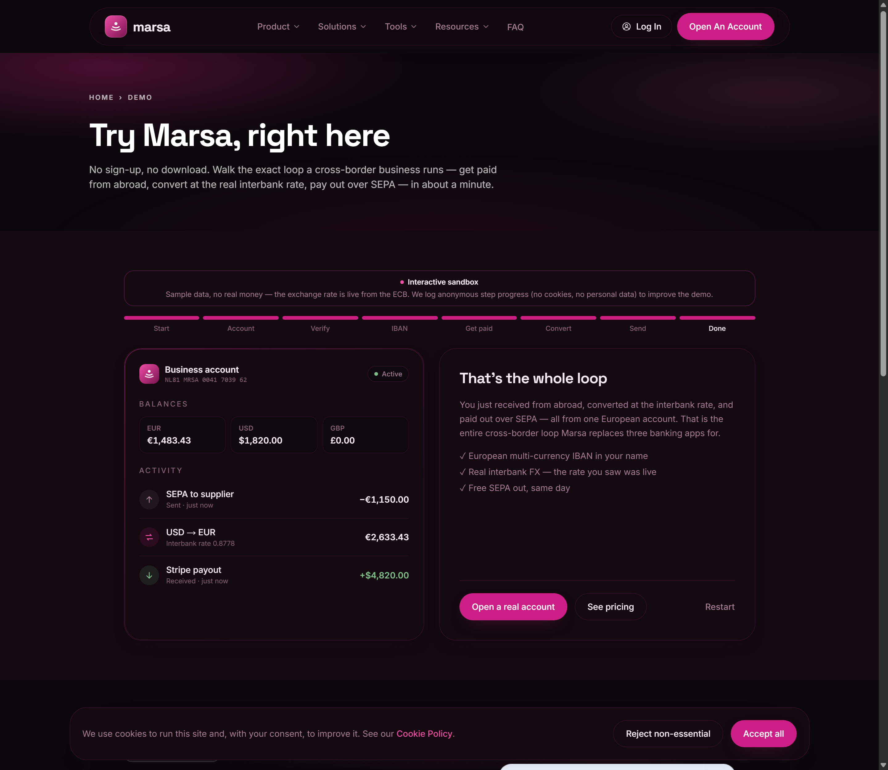
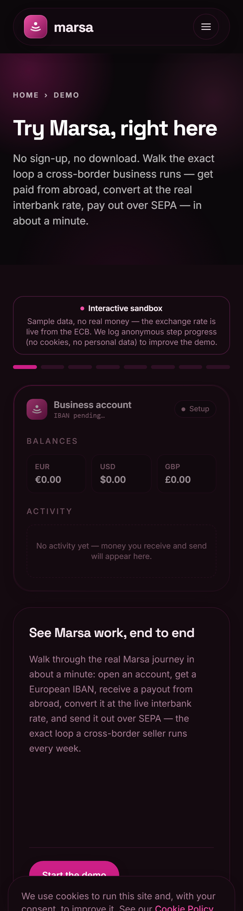

# Marsa

**One account for every currency you get paid in.** Marsa is a multi-currency
account concept for cross-border businesses and freelancers — get paid by
marketplaces and clients abroad, hold 30+ currencies, convert at the interbank
rate, and pay out over SEPA, without a second bank in the middle.

This repository is the **marketing site + lead-capture backend + an interactive
product demo**, built to a production bar (Lighthouse 100s, 0 axe violations,
94 passing tests). It is deliberately honest about what is real software versus
a labelled sandbox — see [What's real vs simulated](#whats-real-vs-simulated).



---

## Highlights

- **Design system: "Black Rose"** — metallic magenta (`#CC1F86` / `#EE4FA5`) on
  near-black (`#0C080B`), dark-only and coherent, driven entirely by CSS custom
  properties. Every foreground/background pair is verified ≥ WCAG AA (see the
  [contrast table](#contrast-verified)).
- **Live FX** — the currency converter and the demo's conversion step use real
  European Central Bank reference rates (via the key-less Frankfurter API),
  cached hourly. No fake numbers.
- **Interactive demo** (`/demo`) — a clickable sandbox that walks the whole
  cross-border loop (open account → KYC → IBAN → receive → convert at the live
  rate → SEPA out) with correct arithmetic and a first-party analytics funnel.
- **Real backend** — on-site forms (lead / contact / newsletter) with shared
  validation, honeypot, rate limiting, durable storage (PostgreSQL or a file
  fallback), optional email notification, a health endpoint, and an
  HMAC-authenticated admin dashboard with CSV export.
- **First-party analytics** — anonymous demo funnel, no cookies, no third-party
  trackers, Do-Not-Track respected.

## Stack

| Layer | Choice |
|---|---|
| Framework | Next.js 15 (App Router, RSC), React 19 |
| Language | TypeScript (strict, **zero `any`**) |
| Styling | Tailwind CSS 3, CSS-variable design tokens |
| Charts | Recharts |
| Storage | PostgreSQL via PostgREST / Supabase — JSONL file fallback |
| Email | Resend REST API (no SDK) |
| FX data | ECB reference rates via Frankfurter (key-less) |
| Tests | Vitest |

No runtime dependencies beyond `next`, `react`, `react-dom`, `recharts`.
Postgres is spoken over HTTP; auth uses WebCrypto HMAC. Nothing else is pulled in.

## Architecture

```
app/
  page.tsx                 Home (hero, live rate ticker, corridor map, sections)
  demo/                    Interactive sandbox + token-gated /demo/stats funnel
  admin/                   HMAC-auth dashboard: submissions, CSV export, funnel
  api/
    rates/ rates/history   Live ECB FX (server-cached)
    leads|contact|subscribe  Form intake → validation → storage → email
    demo/events            First-party funnel telemetry
    admin/*                login / logout / CSV export
    health                 Provider wiring + FX/DB reachability
  (30+ marketing/tool/legal/blog routes)
lib/
  fx.ts                    ECB client, currency formatting
  iban.ts                  ISO 13616 / MOD-97 IBAN validation
  demo.ts                  Demo helpers (valid sample IBAN, funnel steps, money)
  storage.ts               SubmissionStore: Postgres | file, provider selection
  analytics.ts             Demo funnel store + computeFunnel()
  notify.ts                Resend notifier (side-effect, never blocks intake)
  rate-limit.ts            In-memory + shared (Postgres RPC) limiter
  admin-auth.ts            HMAC-signed session cookies, constant-time compare
  csv.ts                   RFC-4180 + formula-injection-safe CSV
  legal.ts / site.ts       Env-gated regulatory copy, site config
db/schema.sql              Postgres schema (submissions, demo_events, rate limit)
```

Design principle throughout: **provider selection by environment**. With zero
config the app runs on file storage and logs; set `SUPABASE_URL` etc. and the
same interfaces switch to Postgres. See `.env.example`.

## Run / test / verify

```bash
npm install
npm run dev            # http://localhost:3000

# Production
npm run build && npm start

# Verification gate (all must be clean)
npm test               # Vitest — 94 tests
npx tsc --noEmit       # types — zero errors, zero `any`
npx next lint          # ESLint — zero warnings
npx next build         # production build
npm audit --omit=dev   # 0 vulnerabilities
```

Optional production wiring (all in `.env.example`): `SUPABASE_URL` +
`SUPABASE_SERVICE_ROLE_KEY` (apply `db/schema.sql` once), `RESEND_API_KEY` +
`RESEND_FROM` for email, `ADMIN_PASSWORD` + `ADMIN_SESSION_SECRET` for `/admin`,
`DEMO_STATS_TOKEN` for a shareable `/demo/stats` link.

## Verified quality

Measured on the production build (see [CASE-STUDY.md](CASE-STUDY.md) for method):

| Check | Result |
|---|---|
| Lighthouse `/` (desktop) | **Performance 100 · Accessibility 100 · Best Practices 100 · SEO 100** |
| Lighthouse `/demo` (desktop) | **100 · 100 · 100 · 100** |
| axe-core (WCAG 2.0/2.1 A+AA) | **29 routes, 0 violations** — automated crawl of each route in its default state; does not cover states reached only by interaction, including form validation errors after a failed submit |
| Responsive (375 / 768 / 1440) | No horizontal overflow on any route |
| Unit tests | **94 / 94 passing** |
| Types / lint / audit | tsc clean · lint clean · 0 vulnerabilities · zero `any` |

### Contrast (verified)

Computed WCAG contrast ratios for the black-rose palette (AA needs ≥ 4.5:1
normal, ≥ 3:1 large/non-text):

| Foreground on background | Ratio | Use |
|---|---|---|
| `#F6EAF1` on `#0C080B` | 17.0:1 | body / headings |
| `#A97F97` on `#0C080B` | 5.85:1 | muted text |
| `#EE4FA5` on `#0C080B` | 5.97:1 | links, eyebrows, focus rings |
| `#FFFFFF` on `#CC1F86` | 5.11:1 | button labels |
| `#7FBF8A` on `#140A10` | 9.0:1 | success / payout amounts |
| `#CC1F86` on `#0C080B` | 3.89:1 | large key numbers only (≥3 large) |

## What's real vs simulated

Honesty matters more than looking finished.

**Real software:**
- ECB FX rates (live, server-cached), driving the converter and demo conversion.
- IBAN validation (ISO 13616 / MOD-97) and the demo's checksum-valid sample IBAN.
- Form intake → validation → durable storage → optional email; admin auth;
  CSV export; rate limiting; health checks; the demo funnel analytics.
- Every calculation and business rule is real code, unit-tested.

**Simulated, and clearly labelled as such:**
- The `/demo` account — balances, transactions, IBAN — is **sample data, no real
  money**. The sandbox banner says so, and discloses the anonymous analytics.
- The homepage account panel is a static illustration (`aria-hidden`).

**Marketing claims:** testimonials and figures like "180+ countries" are
positioning copy for a pre-launch concept, not audited metrics. Regulatory
wording is env-gated: the site only asserts an authorisation when a real
register reference is configured (`lib/legal.ts`), otherwise it describes the
licensed-partner model.

## Roadmap

**Phase B — the actual regulated product (deferred, not built here):**
real customer authentication, accounts, digital KYC via a provider, a
double-entry immutable ledger, money movement through a licensed BaaS partner
(e.g. Currencycloud / Modulr), and transaction monitoring. This is intentionally
not stubbed — half-built auth/ledger would be worse than none. The demo remains a
labelled sandbox until that exists.

Smaller follow-ups: error tracking (Sentry) + product analytics, CI pipeline,
component/e2e tests in CI, i18n (Arabic/French for the MENA wedge), image
optimisation to AVIF/WebP.

## Screenshots

| Demo — convert (live ECB rate) | Demo — done |
|---|---|
|  |  |

Mobile (375 px): 

---

Built as a portfolio piece. Not affiliated with any bank; not a financial
product. See [What's real vs simulated](#whats-real-vs-simulated).
