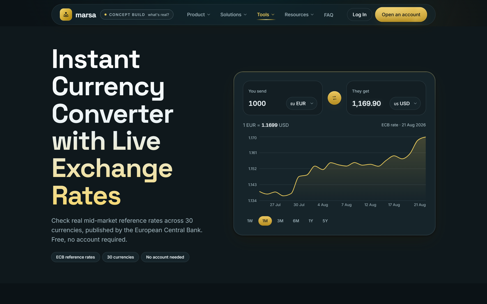
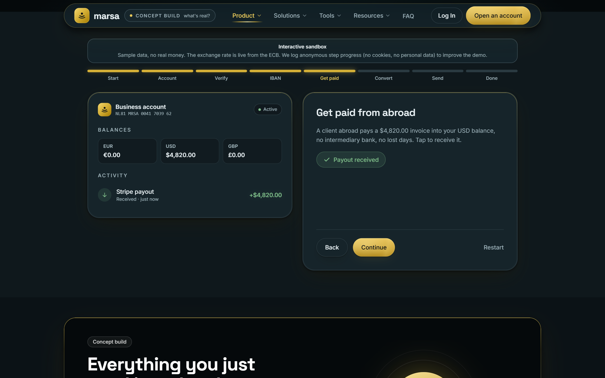
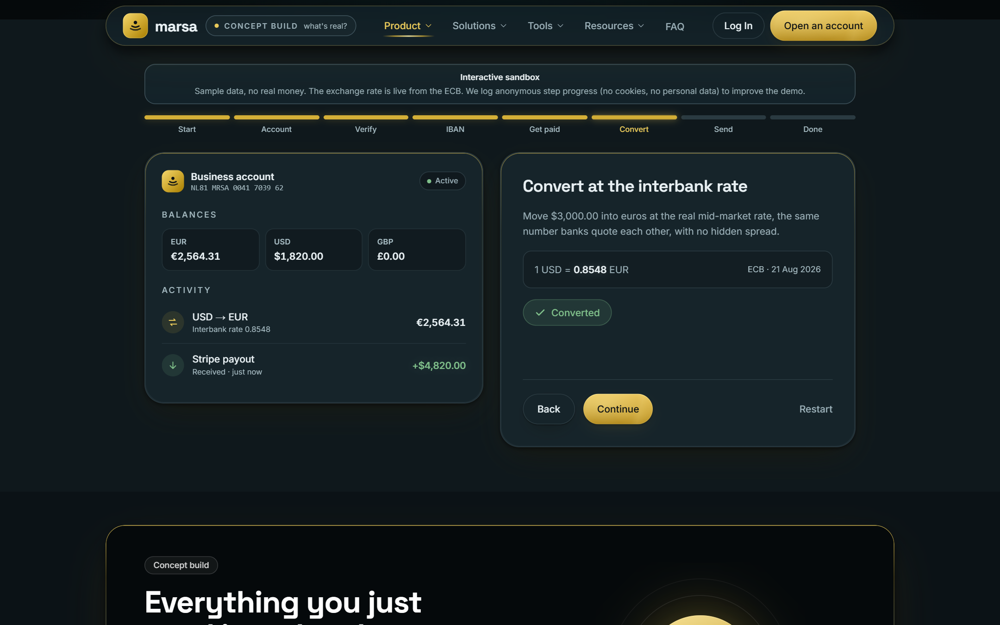
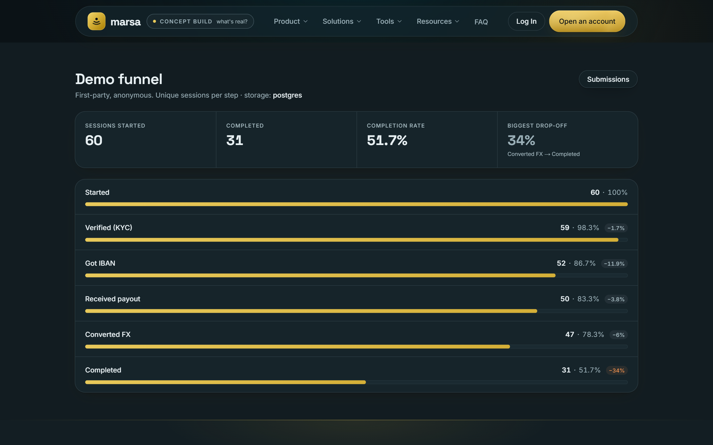
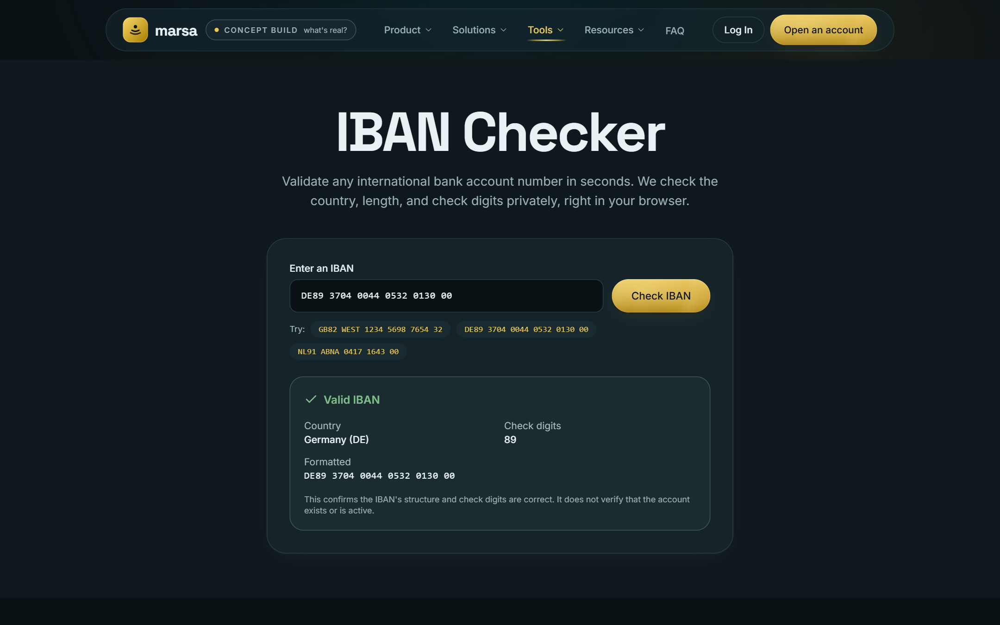
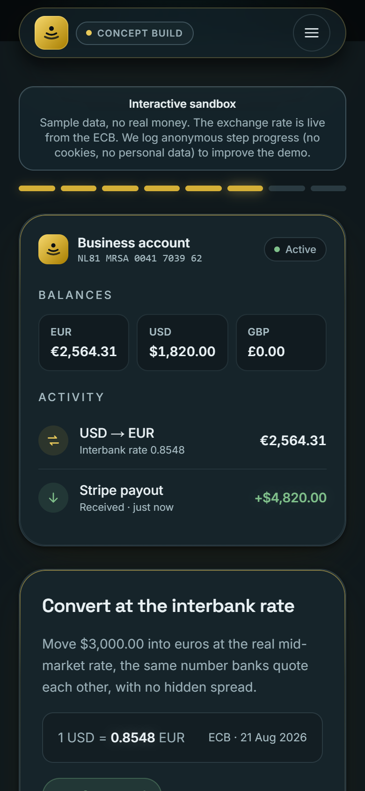

# Marsa

[](https://github.com/elkamohammad1988/marsa-web/actions/workflows/ci.yml)

**A complete multi-currency fintech application — marketing site, customer
accounts, operator dashboard and an interactive product demo — built end to end
in Next.js 15, TypeScript and Postgres.**

Marsa is a concept build: the financial product it depicts is simulated, while
the application around it is real, running software. Authentication, per-row
database permissions, validation, rate limiting, live third-party data and the
test suite are all genuinely implemented and independently verifiable in this
repository.

**[▶ Live demo — marsa-web.vercel.app](https://marsa-web.vercel.app)**


---

## What you can try right now

The deployment runs with **no database credentials configured**, which decides
what a visitor can reach. That is a deliberate choice, not an unfinished one.

| Working on the live demo | Deliberately closed |
|---|---|
| The whole marketing site, at every breakpoint | `/account` — customer accounts need `SUPABASE_ANON_KEY` and `AUTH_SESSION_SECRET` |
| `/demo` — the interactive sandbox, end to end | `/admin` — the operator dashboard needs `ADMIN_PASSWORD` |
| Live European Central Bank rates and 30-day history | |
| ISO 13616 IBAN validation, entirely offline | |
| 404 and error boundaries, sitemap, structured data | |

**Why the authenticated areas are shut rather than half-working.** Standing up
live accounts for a product nobody can sign up to would mean holding real email
addresses for a company that does not exist. The code, the row-level-security
migration and the tests are all in this repository and run from a clean clone —
what is missing from the demo is a database, not a feature. `/api/health`
reports `degraded` for the same reason, which is the application refusing to
pretend.

---

## Key capabilities

- **Customer accounts with real data isolation.** Registration, email
  confirmation, sign-in, password reset, and sessions that renew silently in the
  background. Permissions are defined in Postgres Row Level Security (migration
  `004`) rather than in a route handler, so one customer cannot read another's
  record even if application code asks it to. Written and unit-tested against a
  stubbed PostgREST — no Supabase project is connected, so the policies have not
  yet run against a live database.
- **An operator dashboard.** Form submissions, search, CSV export, single-record
  erasure for a GDPR Article 17 request, and a first-party analytics funnel —
  no cookies, no third-party trackers. An admin session can be revoked by
  bumping one environment variable, without rotating the signing secret.
- **Live financial data.** The converter and the demo's conversion step run on
  real European Central Bank reference rates, cached server-side, degrading
  gracefully when the source is unreachable. No invented numbers.
- **An interactive product demo.** `/demo` walks the whole cross-border loop —
  open account → verify → European IBAN → receive a payout → convert at the live
  rate → send over SEPA — with correct arithmetic and a checksum-valid sample
  IBAN, clearly labelled as a sandbox.
- **A backend that does not lose things.** Shared client/server validation,
  honeypot, cross-instance rate limiting, durable storage, and email notification
  as a side effect that can never block an intake.

---

## Screenshots

All are photographed from a production build by `npm run capture` rather than
mocked up, and they are only ever as current as the last run — which is a
weaker guarantee than "cannot drift", the claim that stood here until it turned
out to be false. The set went a commit stale when a UI cleanup removed
decoration the images still showed, so **re-run the capture before publishing
them anywhere**. Regenerated 2026-08-22, `05-analytics.png` excepted — see
below. **Every one carries the concept-build disclosure**, because the site
does — the capture script throws rather than write an unmarked image, and
[`tests/portfolio-honesty.test.ts`](tests/portfolio-honesty.test.ts)
fails if that rule is ever softened.

| | |
|---|---|
| **Live ECB rates** — the converter and its 30-day history, on real European Central Bank data  | **Get paid from abroad** — the demo at the point a payout lands in the USD balance  |
| **Convert at the interbank rate** — the same live rate, applied  | **Operator dashboard** — the demo funnel, first-party and anonymous, behind authentication  |
| **IBAN validation** — ISO 13616 / MOD-97, entirely offline  | **The same flow at 390 px** — not the hero reflowed, the demo mid-conversion  |

`/admin` itself is deliberately never captured: it renders live form
submissions, which on any machine that has used the contact form means a real
name and email address in an image intended for a public listing. The funnel
view carries the same message and is anonymous by construction.

`05-analytics.png` is the one image in the set still dated 2026-08-20, and the
reason is worth recording. Re-shooting it against the local JSONL fallback
produced a funnel reading **`Verified (KYC) · 116.7%`** — more sessions at the
second step than the first, because that dev file holds sessions whose `start`
beacon never arrived while their later steps did. The number is real, the data
behind it is local scratch, and the page has no guard against a step exceeding
the one above it. Rather than publish a dashboard that looks broken or
hand-edit a data file until it flattered the product, the previous capture
stands; it differs from the current build by one `←` glyph on a button. The
missing guard is filed as a real defect, not a screenshot problem — see *Still
open* in [`docs/PROJECT-PLAN.md`](docs/PROJECT-PLAN.md#still-open).

---

## Technology

| Layer | Choice |
|---|---|
| Framework | Next.js 15 (App Router, RSC), React 19 |
| Language | TypeScript (strict, **zero `any`**) |
| Styling | Tailwind CSS 3, CSS-variable design tokens |
| Database | PostgreSQL via Supabase — JSONL file fallback for local development |
| Auth | Supabase Auth (GoTrue) over REST, **no SDK** — signed `httpOnly` cookies, Postgres RLS |
| Charts | Recharts |
| Email | Resend REST API (no SDK) |
| FX data | ECB reference rates via Frankfurter (key-less) |
| Tests | Vitest (unit) · Puppeteer + Chrome (browser smoke) · GitHub Actions |

**Four runtime dependencies:** `next`, `react`, `react-dom`, `recharts`.
Postgres and Supabase Auth are both spoken over HTTP and session cookies are
signed with WebCrypto HMAC, so nothing else is pulled in — including
`@supabase/ssr`, which is skipped for a reason worth reading:
[why no SDK](AUTHENTICATION.md#1-no-supabase-sdk).

---

## Engineering highlights

**Design system — "Liquid Gold".** Metallic gold (`#D4AF37` / `#E8C95A`) on
deep water-slate (`#0B1216`), dark-only and coherent, driven entirely by CSS
custom properties. The palette it replaced was metallic magenta; the swap
touched two files and no component logic, which is the claim the token layer
exists to make good on. A slow water-reflection effect carries the identity on
the surfaces that hold the brand, and stops entirely under
`prefers-reduced-motion`.

**Provider selection by environment.** Every side-effect layer — storage, email,
rate limiting, analytics — picks its implementation from environment variables
behind one interface. Zero config runs the whole app on a file store; set
`SUPABASE_URL` and the same code talks to Postgres. That is what makes this
repository runnable in one command and production-real when wired.

**The file store is a development convenience, never a production path.** It
reads and sorts the whole dataset per request and is invisible to any other
instance, so `createStore()` **refuses to build it** when `NODE_ENV=production`
and names the missing variables instead. Silently losing a lead is the failure
mode that rule exists to make impossible.

**Failures are reported, not swallowed.** Every degradation the system chooses
to absorb — a write that failed, an email that never sent, a rate limiter
running without its database — emits a structured event through
`lib/observability.ts` with personal data redacted before it can leave the
process. Visitors get a reference code; the detail stays in the log.

Deeper detail lives in [`CASE-STUDY.md`](CASE-STUDY.md) (design and product
decisions) and [`docs/`](docs/) (architecture, audit history, deployment).

---

## Security and authentication

**Two separate authentication systems, deliberately.** `/admin` is one shared
operator password guarding form submissions; `/account` is customer accounts
guarding a person's own data. They share the cookie-signing primitive and
nothing else, because merging them would let the operator password read
customer rows.

- **The database is what decides who reads what.** The administrator's account
  list is written as *"select every profile"* with no role filter; migration
  `004`'s policies are what hold it to one row for everybody else, rather than a
  filter a future route handler could forget. `profiles.role` is granted away
  from the `authenticated` database role, so an attempt to change it from a
  browser session fails at Postgres rather than at a check in application code.
- **Sessions.** An HMAC-signed `httpOnly` envelope, renewed silently in
  middleware before the access token expires, with an absolute 30-day ceiling
  that a refresh cannot extend.
- **Rate limiting that fits the attack.** Escalating windows per IP *and* per
  account, because a password list run against one address from rotating IPs
  trips neither alone. Email addresses are HMAC-bucketed before they reach the
  limiter's table, so it never becomes an unretained store of personal data.
- **No account enumeration.** Sign-in, password recovery and confirmation
  re-sends return an identical response whether or not the address has an
  account — including when the upstream call fails.
- **Headers.** A real Content-Security-Policy, HSTS with preload,
  `frame-ancestors 'none'`, and `Cross-Origin-Opener-Policy: same-origin`.

**What that status is, exactly.** Everything under `db/migrations/` — the
row-level-security policies included — is **prepared infrastructure: written,
unit-tested against a stubbed PostgREST, and applied nowhere.** No Supabase
project is connected to this build, which `/api/health` reports as
`database: configured:false`. The reasoning above describes how the schema is
written to behave, not a result measured against a running Postgres, and it is
worth reading with that distinction in mind.

Full setup and threat reasoning: [`AUTHENTICATION.md`](AUTHENTICATION.md).

---

## Testing and quality

`npm run verify` runs the gate in order, and CI runs the same work as two
required jobs — those four steps plus `npm audit --audit-level=high`, and the
browser suite below as a second job — so the badge above is the live answer
rather than a claim in prose.

```bash
npm install
npm run dev            # http://localhost:3000

npm run verify         # typecheck → lint → tests → production build
npm audit              # 0 vulnerabilities, dev tree included
```

**What the suite covers.** 1,885 automated checks across 53 files, all running
in Node — plus 139 browser checks in a separate suite, below:

- **Unit tests for business logic and security boundaries** — IBAN MOD-97, FX
  conversion, storage provider selection, admin auth (HMAC round-trip, tamper,
  expiry), session signing and expiry, RLS-backed profile reads, CSV
  formula-injection safety, rate-limit tiers, and the analytics funnel.
- **Property tests** that recompute outcomes rather than assert spellings — most
  usefully [`tests/contrast.test.ts`](tests/contrast.test.ts), which computes
  real WCAG ratios from the token values in `styles/globals.css`, so darkening a
  colour fails the build.
- **Repository-integrity checks** that assert properties the other gates cannot
  see: no anchor nested inside an anchor, no colour utility naming an undefined
  token, no page claiming the build collects nothing, a length budget on every
  `<title>`, every page carrying exactly one top-level heading, no font size
  smuggled into `<Heading>` through `className` — a real defect that had every
  auth page rendering its `<h1>` *larger* on a phone than on a desktop — and
  the honesty rules on the screenshots. Two of them ask git itself rather than
  reading a config file: whether every `.data/*.jsonl` store is ignored, since
  the repository is public and a negation inside an ignored *directory*
  silently does nothing.

**A browser suite, separately.** [`tests/smoke/`](tests/smoke/) drives a real
Chrome against a production build — 139 checks in three files.

[`public-site.smoke.ts`](tests/smoke/public-site.smoke.ts) covers every public
route: each one answers 200 with exactly one `<h1>` and no console error, failed
request or uncaught exception; nothing clickable is a dead `href="#"`; every form
control has a label; blog pagination walks forward and back by keyboard; the IBAN
checker accepts and rejects on the checksum; the FX tools fetch a live rate on
mount and again when the pair changes; the FAQ accordion and the navbar dropdown
work by mouse *and* by key; the mobile menu opens at 390px without the page
scrolling sideways; and a missing URL is a real 404 with a way home.

[`admin-dashboard.smoke.ts`](tests/smoke/admin-dashboard.smoke.ts) signs an
operator in behind the real password — against an in-process PostgREST stand-in,
so `lib/postgrest.ts` is genuinely exercised and no database is required — then
searches, filters, pages forward and back, exports the CSV, erases a record
through its confirmation step and signs out. **It exists because two of those
buttons did nothing in a browser while every other gate was green**: the erasure
and sign-out endpoints answered with an absolute redirect rebuilt from
`request.url`, which `form-action 'self'` blocks whenever the server's idea of
its own host differs from the document's — so the record was erased, the session
was destroyed, and the operator was shown neither. The filters and the pagination
were dead for a different reason, in the same place: on a `force-dynamic` route,
a `<Link>` that changes only the query string fetches its payload and never
commits it.

[`accessibility.smoke.ts`](tests/smoke/accessibility.smoke.ts) runs axe-core
over every public route at 390px and 1280px, over the six states a page load
never reaches — the mobile menu open, the concept disclosure open, a navbar
dropdown open, the FAQ accordion expanded, a form showing its validation errors,
and the demo driven to its final step — and over the operator dashboard behind
its cookie, at both widths. **74 scans, 0 violations.**

It waits for the page to stop moving before it measures, which is the whole
difference between a scan and a guess: the reveal animations transition opacity
from zero, axe folds an ancestor's opacity into its contrast calculation, and a
scan that lands mid-transition reports half-faded text as a serious
colour-contrast failure that existed for a third of a second. Zero violations
here means no machine-detectable failure on those states, not a certified audit.

It is a **second CI job**, not a step in `npm run verify`, because the unit gate
is fast precisely by building nothing and starting nothing. Two commands:

```bash
npm run build && npm run test:smoke    # needs Chrome; the harness never skips
npm run verify:all                     # verify, then the browser suite
```

**What it does not cover, stated plainly:** there is no component-level DOM
suite — nothing renders a single component in isolation and asserts its
markup. The browser suite covers whole pages, and the unit suite covers logic;
the layer between them is not tested.

**Accessibility.** Skip link, landmarks, visible focus, decorative art marked
`aria-hidden`, and every foreground/background pair verified against WCAG AA by
computation on every test run:

| Pair | Ratio | Use |
|---|---|---|
| `#E9F1F4` on `#0B1216` | 16.5:1 | body / headings |
| `#E8C95A` on `#0B1216` | 11.6:1 | links, eyebrows, focus rings |
| `#0C1114` on `#D4AF37` | 9.0:1 | button labels on the gold fill |
| `#9BB0B8` on `#0B1216` | 8.4:1 | muted text |
| `#7FBF8A` on `#16242A` | 7.4:1 | success / payout amounts |
| `#D4AF37` on `#1A2A31` | 7.0:1 | large key numbers |
| `#E88A8A` on `#16242A` | 6.4:1 | form errors |

The axe-core pass is no longer a point-in-time audit. It used to be an untracked
script at the repository root — so the one number this README offered for
checking was the one a reader could not check — and its last recorded run had
crashed on a streamed form. It is now [`accessibility.smoke.ts`](tests/smoke/accessibility.smoke.ts),
committed, reproducible, and runnable from a clean clone. The Lighthouse figures
in [`CASE-STUDY.md`](CASE-STUDY.md) are still point-in-time and say so.

---

## What's real vs simulated

Honesty matters more than looking finished.

**Real software:**

- ECB FX rates — live, server-cached, driving the converter and the demo conversion.
- IBAN validation (ISO 13616 / MOD-97) and the demo's checksum-valid sample IBAN.
- **Customer accounts** — registration, confirmation, sign-in, password reset,
  session persistence with silent renewal, and a role model written against Row
  Level Security. Real code, unit-tested against a stubbed Supabase, and **not
  yet run against a live one**: no project is connected, so this is the one
  capability in this list that has never been exercised end to end. Wired up,
  creating an account would store your email address and, if you give one, your
  name, and would open a profile page and nothing else — there is no money
  anywhere in this project.
- Form intake → validation → durable storage → optional email; admin auth; CSV
  export; rate limiting; health checks; demo funnel analytics.
- Every calculation and business rule is real code, unit-tested.

**Simulated, and labelled as such on screen:**

- The `/demo` account — balances, transactions, IBAN — is sample data. The
  sandbox banner says so and discloses the anonymous analytics.
- The homepage account panel is a static illustration (`aria-hidden`).
- **The public marketing forms deliberately transmit and store nothing.** Nobody
  reads a lead here, so collecting a real name and address behind "we'll email
  you within one business day" would be a false promise. They validate through
  the same `lib/validation.ts` the API uses, then discard the input and explain
  what a real submission would have done. The pipeline itself stays fully
  unit-tested.

**Marketing claims:** there are no testimonials — the invented people this site
once quoted were removed rather than rewritten, because a concept has no
customers to quote. Figures like "180+ countries" are the product's design
scope, not audited metrics. Regulatory wording is environment-gated: the site
only asserts an authorisation when a real register reference is configured,
otherwise it describes the licensed-partner model.

**Imagery:** there is none. Every illustration is drawn in markup, each carrying
its own description keyed off the same union the drawing is, so an illustration
cannot be mislabelled.

---

## Deployment

Deploys to Vercel, Netlify, or any Node host. The environment is validated at
server start, so a half-configured pair fails loudly in production rather than
degrading in silence.

Optional production wiring, all documented in `.env.example`:

| Variables | Turns on |
|---|---|
| `SUPABASE_URL` + `SUPABASE_SERVICE_ROLE_KEY` | Durable storage (then run `npm run db:migrate`) |
| `SUPABASE_URL` + `SUPABASE_ANON_KEY` + `AUTH_SESSION_SECRET` | Customer accounts |
| `ADMIN_PASSWORD` + `ADMIN_SESSION_SECRET` | The operator dashboard |
| `RESEND_API_KEY` + `RESEND_FROM` | Email notification |

Customer accounts need three further steps that cannot be done from code — one
migration and two Supabase dashboard settings — all written out in
[`AUTHENTICATION.md`](AUTHENTICATION.md#setup). Until they are done, every auth
page renders a panel naming exactly what is missing rather than a form that
would fail.

Full runbook: [`docs/DEPLOYMENT.md`](docs/DEPLOYMENT.md).

---

## Roadmap

**Phase B — the regulated money product — is deliberately not built and not
stubbed:** digital KYC through a provider, a double-entry immutable ledger,
money movement through a licensed BaaS partner, and transaction monitoring.
Each needs a regulated entity behind it that does not exist, and a half-built
ledger would be worse than none.

Smaller follow-ups tracked in [`docs/PROJECT-PLAN.md`](docs/PROJECT-PLAN.md):
an error-tracking adapter, product analytics, a component-level DOM suite, a
retention period for form submissions — a legal decision rather than an
engineering one — and i18n.

---

**Marsa is a concept build.** It is not a bank, not an e-money institution, not
a licensed payment service, and not affiliated with any financial institution.
It holds no money and moves none, it has no customers, and no part of it is or
has been in production use. Balances and transactions shown anywhere in this
project are simulated.

Licensed under the [MIT License](LICENSE).
